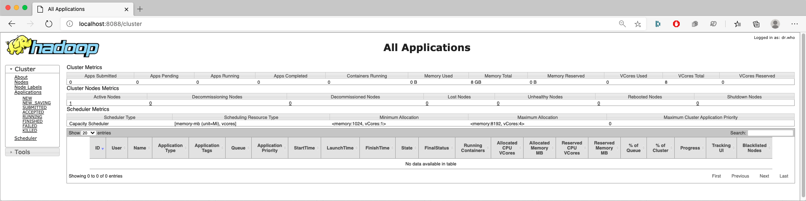

# Learning Big Data Computing with Spark
Homework 2 for CS 6220 Big Data Systems &amp; Analytics


### Problem 3. Learning Big Data Computing with Hadoop and/or Spark MapReduce

For this homework, I chose to complete Option 2 of Problem 3.

#### Requirements:
Installed software required to run the programs in this repository:
- Java 14.0.2
- JDK 14.0.2
- Hadoop 3.3.0
- Scala 2.12.1
- Spark 3.0.1
- Git 2.28.0 (optional)

#### My system description:
Specifications of the machine I used to run the programs in this repository:
- macOS Catalina (10.15.6)
- 2 GHz Quad-Core Intel Core i5 (10th Generation)
- 16 GB RAM
- 500 GB SSD
- Hadoop running on Pseudo-Distributed mode
- Apache Spark 3

#### Repository Folder Structure:
- **input:** 
    - All text inputs used for the jobs.
- **WordCount:** 
    - Java MapReduce program to count the occurance of each word in a document or body of documents.
- **WordCountSpark:** 
    - Scala Spark  program to find the occurance of each word in a document or body of documents.
- **output:** 
    - All outputs from the MapReduce jobs.
- **images:** 
    - Contains all images used in the Readme file.

### 1. HDFS Installation:

The first step of this homework was to setup HDFS in my local machine. In order to do so, I installed Java and Hadoop and edited the necessary configuration files.

- **Hadoop version:** 3.3.0
- **Hadoop mode:** Pseudo-Distributed (<value>1</value> on the hdfs-site.xml configuration file)
- **hadoop command** is available globally (hadoop binary files were added to the path)


- **Configuration File Edits:**
  - **hadoop-env.sh**:
    Make sure to set export **JAVA_HOME** to the the Java home location in your machine.
  - **core-site.xml**:

```xml
    <configuration>
      <property>
        <name>hadoop.tmp.dir</name>
        <value>/usr/local/Cellar/hadoop/hdfs/tmp</value>
        <description>A base for other temporary directories</description>             
      </property>
      <property>
        <name>fs.default.name</name>
        <value>hdfs://localhost:8020</value>
      </property>
    </configuration>
```
-
  - **mapred-site.xml**:

```xml
    <configuration>
      <property>
        <name>mapred.job.tracker</name>
        <value>localhost:8021</value>
      </property>
    </configuration>
```
-
  - **hdfs-site.xml**:

```xml
    <configuration>
      <property>
        <name>dfs.replication</name>
        <value>1</value>
      </property>
    </configuration>
```


Since my computer was running macOS I found the following installation tutorial very helpful: https://medium.com/beeranddiapers/installing-hadoop-on-mac-a9a3649dbc4d

If you are running Windows you can follow this tutorial: https://towardsdatascience.com/installing-hadoop-3-2-1-single-node-cluster-on-windows-10-ac258dd48aef

If you running Linux, you can follow the offical Apache Hadoop documentation: https://hadoop.apache.org/docs/stable/hadoop-project-dist/hadoop-common/SingleCluster.html

 ***After installing HDFS, start all services by running the start-all.sh script on the sbin folder inside the hadoop folder.***

- **Resource Manager Screenshot:**


- **JobTracker Screenshot:**



- **Node Manager Screenshot:**


### 2. Apache Spark Installation:

Since my computer was running macOS, I followed these steps to install Apache Spark on my local machine (using Homebrew):

- Install xcode-select:
```shell
    xcode-select --install
```
- Install Scala:
```shell
    brew install scala
```
- Install Apache Spark:
```shell
    brew install apache-spark
```

If you running Window or Linux, you can follow the offical Apache Spark documentation: https://spark.apache.org/docs/latest/

To check if Spark was properly installed, try opening the Spark CLI by running the following command:

```shell
    spark-shell
```

- You should see a similar  message in your terminal window:


To start running Spark, you should go to the sbin folder inside apache-spark installation folder and execute the *start-all.sh* shell script:

```shell
    cd /usr/local/Cellar/apache-spark/3.0.1/libexec/sbin/
    ./start-all.sh
```

- **Spark Master UI Screenshot:**


### 3. Data:

A number of different text files were used was input data for this homework. They are all saved in the input folder.

- american_pie.txt: 
  - lyrics to the song American Pie by Don McLean, obtained from https://www.letras.com/don-mclean/25411/
- hamlet.txt: 
  - William Shakespeare's famous tragedy Hamlet, obtained from https://gist.github.com/provpup/2fc41686eab7400b796b
- charles_dikens: 
  - this folder contains the 20 books published by the famous English author Charles Dickens.
  - These files were obtained from *Project Gutenberg* using the Gutenberg python library to fetch the data.
  - You can run the Jupyter notebook /import_books/import_charles_dickens_books.ipynb to understand the process.
- bbc_tech_news:
  - This folder contains 401 news articles by BBC on the topic of Technology.
  - The data was obtained from http://mlg.ucd.ie/datasets/bbc.html
- song_lyrics:
  - This data set contains the lyrics of songs by a number of different aritsts. For each artist, all of his or her lyrics were saved as a single txt file.
  - The data was obtained from https://www.kaggle.com/paultimothymooney/poetry
  - I manually subdivided the artists into four main genres:
    - Pop: 11 aritsts
    - Rock: 13 aritsts
    - Folk/Country: 6 aritsts
    - Hip-Hop: 11 aritsts
    
- Saving the data on HDFS:
  - To save the input data on HDFS, you just need to run the export_inputs.sh shell script in the root directory of the project by running the following command:
```shell
    sh export_inputs.sh
```
In my machine, the script took ~25 seconds to run.

### 3. Hadoop MapReduce WordCount:

This is a classic MapReduce problem where you take a document (or group of documents) as input and output all the different words sorted alphabetically along with the number of times each one occured in the document or corpus.

- Job Diagram:


This image was obtained from https://www.edureka.co/blog/mapreduce-tutorial/

- As a starting point, I used the MapReducde tutorial on the official Apache Hadoop website https://hadoop.apache.org/docs/current/hadoop-mapreduce-client/hadoop-mapreduce-client-core/MapReduceTutorial.html .

- After compiling and running the program, I noticed that it was not filtering out punctuation or unusual characters after splitting the text based on whitespace " ". This lead to strings like \[first,], \[who and tears- being considered distinct words.

- Steps to solve this problem:
  - Eliminating all characters besides letters, hyphens (-) and single apostrophes (')
  - After the initial filtering, keep only hyphens or apostrophes that appeared inside a word (e.g. Bye-bye or Nature's)
  - Standardizing the letter case by capitalizing the first letter in each word (e.g. Apple instead of apple, APPLE or aPpLe)
```java
while (itr.hasMoreTokens()) {
                word = itr.nextToken();
                String pattern = "[^\\-'A-Za-z]+";
                word = word.replaceAll(pattern,"");
                if (word.length() > 0) {
                    int start = 0;
                    while (start < word.length()){
                        if (!Character.isLetter(word.charAt(start))) ++start;
                        else break;
                    }
                    int end = Character.isLetter(word.charAt(word.length()-1)) ? word.length() : word.length() - 1;
                    if (end < start) end = start;
                    word = word.substring(start,end);
                    if (word.length() > 0) {
                        word = word.substring(0, 1).toUpperCase() + word.substring(1).toLowerCase();
                        clean_word.set(word);
                        context.write(clean_word, one);
                    }
                }
```
- **Running the program:**
  - To run the MapReduce job, you need to change directories to WordCount/src and run the word_count.sh shell script by running the following commands from the root directory of the repository:
```shell
    cd WordCount/src
    sh word_count.sh
```
In my machine, the script took **~40 seconds** to run (including the time it takes to print all the progress reports to the terminal).

- Portion of a MapReduce successful job feedback message:


- Portion of a MapReduce WordCount job output:
```txt
    A       18
    About   1
    Above   1
    Adjourned       1
    Admire  1
    Again   1
    Ago     1
    Air     1
    All     3
    American        7
    And     37
    Angel   1
    As      2
    Asked   1
    Away    1
    Bad     1
    Band    1
    Be      17
    Been    1
```
- **Performance Analysis:**

|     Dataset     |  Size  | # of Files | Time Elapsed | # of Unique Words |
|:---------------:|:------:|:----------:|:------------:|:-----------------:|
|   American Pie  |  4 KB  |      1     |     3 ms     |        313        |
|      Hamlet     | 192 KB |      1     |     5 ms     |        4835       |
| Charles Dickens | 6.4 MB |     20     |     37 ms    |       45,331      |
|  BBC Tech News  | 1.2 MB |     401    |    183 ms    |       12,673      |
|   Song Lyrics   | 5.6 MB |     41     |     51 ms    |       27,254      |


### 3. Spark MapReduce WordCount:

After implementing the word count in Hadoop MapReduce, I also implemented it in Spark. I chose to implemented in Scala which is Apache Spark's native language

- Implementation:

```scala
object WordCount {
  def main(args: Array[String]) = {
    val sparkConf = new SparkConf()
    sparkConf.setMaster("local")
    sparkConf.setAppName("Word Count")
    val sc = new SparkContext(sparkConf)
    val textFile1 = sc.textFile("hdfs://localhost:8020/input/american_pie.txt")
    val counts1 = textFile1.flatMap(line => line.split(" "))
      .map(word => (word, 1))
      .reduceByKey(_ + _)
    counts1.saveAsTextFile("hdfs://localhost:8020/output/spark_word_count_american_pie")

    val textFile2 = sc.textFile("hdfs://localhost:8020/input/hamlet.txt")
    val counts2 = textFile2.flatMap(line => line.split(" "))
      .map(word => (word, 1))
      .reduceByKey(_ + _)
    counts2.saveAsTextFile("hdfs://localhost:8020/output/spark_word_count_hamlet")

    val textFile3 = sc.textFile("hdfs://localhost:8020/input/bbc_tech_news")
    val counts3 = textFile3.flatMap(line => line.split(" "))
      .map(word => (word, 1))
      .reduceByKey(_ + _)
    counts3.saveAsTextFile("hdfs://localhost:8020/output/spark_word_count_bbc_tech_news")

    val textFile4 = sc.textFile("hdfs://localhost:8020/input/charles_dickens")
    val counts4 = textFile4.flatMap(line => line.split(" "))
      .map(word => (word, 1))
      .reduceByKey(_ + _)
    counts4.saveAsTextFile("hdfs://localhost:8020/output/spark_word_count_charles_dickens")

    val textFile5 = sc.textFile("hdfs://localhost:8020/input/song_lyrics/all_genres")
    val counts5 = textFile5.flatMap(line => line.split(" "))
      .map(word => (word, 1))
      .reduceByKey(_ + _)
    counts5.saveAsTextFile("hdfs://localhost:8020/output/spark_word_count_song_lyrics")

  }
}
```
- **Running the program:**
  - To run the Scala Program found at 
```

- Portion of a MapReduce successful job feedback message:


- Portion of a MapReduce WordCount job output:
```txt
    (grows,1)
    (sweet,1)
    (practiced,1)
    (Lennon,1)
    (God,1)
    (paper,1)
    (it,1)
    (The,16)
    (queen,1)
    (teenage,1)
```
- **Performance Analysis:**

|     Dataset     |  Size  | # of Files | Time Elapsed | # of Unique Words |
|:---------------:|:------:|:----------:|:------------:|:-----------------:|
|   American Pie  |  4 KB  |      1     |     0.895 s     |        313        |
|      Hamlet     | 192 KB |      1     |     1.09 s     |        4835       |
| Charles Dickens | 6.4 MB |     20     |     4.62 s    |       45,331      |
|  BBC Tech News  | 1.2 MB |     401    |    44.17 s    |       12,673      |
|   Song Lyrics   | 5.6 MB |     41     |     6.61 s    |       27,254      |

As can be seen, the Spark Word Count jobs took significantly longer to run when compared to Hadoop MapReduce. Usually, Spark tends to be a lot faster since it keeps all the RDDs in memory. The reason for these different results could be due to the fact that I was running it on a single machine and that this time included the time needed to loead the data sets from the disk to memory.


